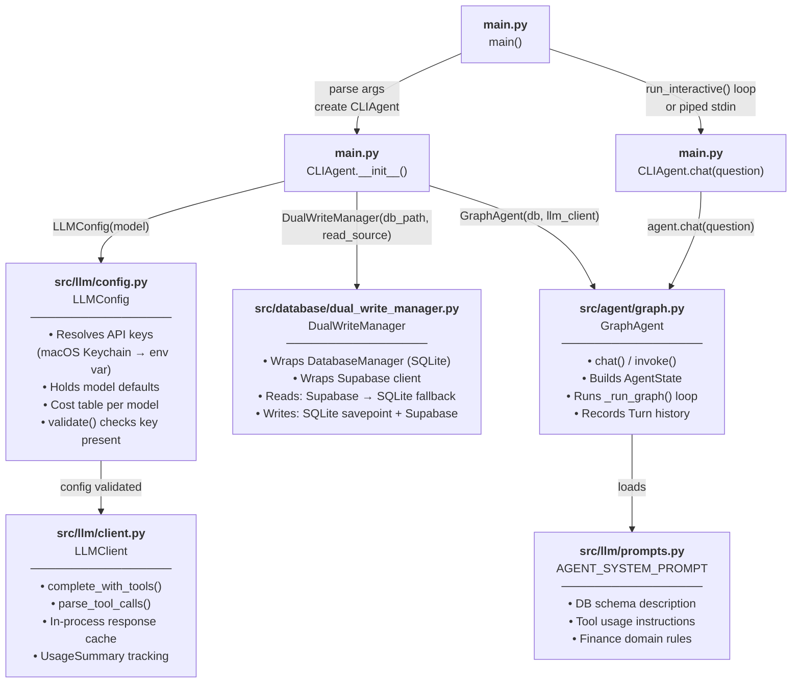
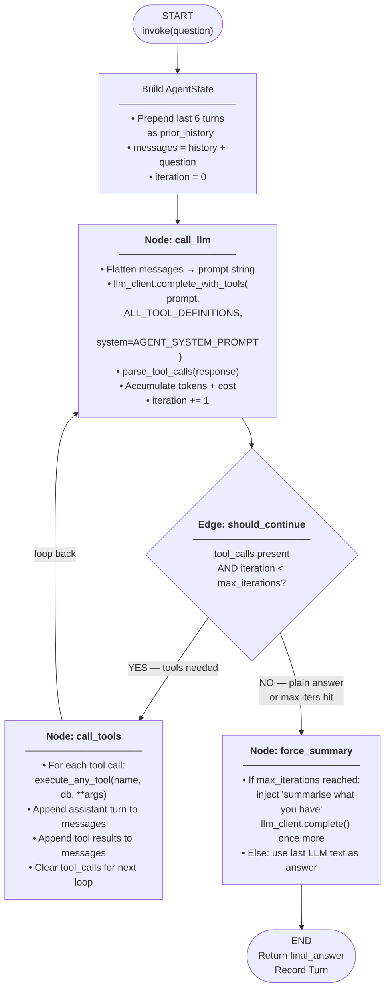
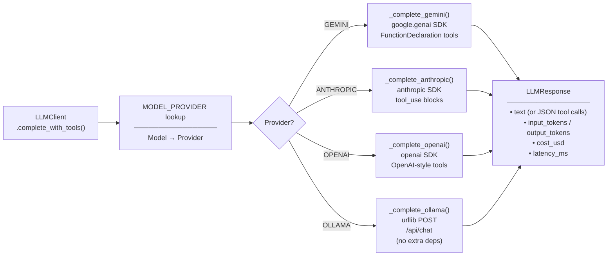
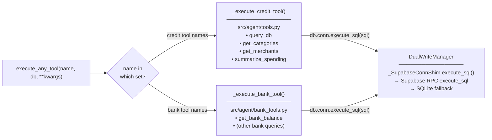
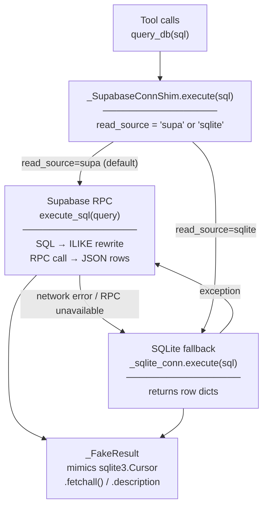

# Credit Card Transactions — Control Flow Diagram

Traces the execution path from `main.py` through every component touched at runtime.

---

## High-Level Flow



---

## GraphAgent Internal Loop



---

## LLMClient Provider Dispatch



---

## Unified Tool Dispatch



---

## DualWriteManager Read Path



---

## Component Summary Table

| Component | File | Role |
|-----------|------|------|
| `main()` | `main.py` | CLI entry point; parses `--provider`, `--model`, `--db-source` |
| `CLIAgent` | `main.py` | Session wrapper; tracks turns, cost, pretty-prints |
| `LLMConfig` | `src/llm/config.py` | API key resolution (Keychain → env); model/cost metadata |
| `LLMClient` | `src/llm/client.py` | Unified LLM API; provider dispatch; tool-call parsing; cache |
| `GraphAgent` | `src/agent/graph.py` | Stateful agentic loop (call_llm → should_continue → call_tools) |
| `AGENT_SYSTEM_PROMPT` | `src/llm/prompts.py` | Finance-domain instructions + DB schema injected into every LLM call |
| `execute_any_tool` | `src/agent/unified_tools.py` | Routes tool name → credit tools or bank tools |
| `DualWriteManager` | `src/database/dual_write_manager.py` | Dual read/write: Supabase primary, SQLite fallback |
| `_SupabaseConnShim` | `src/database/dual_write_manager.py` | sqlite3.Connection-compatible shim; translates SQL → Supabase RPC |
| `DatabaseManager` | `src/database/db_manager.py` | SQLite connection; underlying local store |

---

## Key Data Types Flowing Between Components

```
CLIAgent.chat(question: str)
    → GraphAgent.invoke(question: str)
        → AgentState (TypedDict)
            { messages: list[dict],     # role/content pairs
              tool_calls: list[dict],   # [{"name":..., "args":{...}}]
              llm_response: dict,       # text, tokens, cost
              iteration: int,
              final_answer: str }
        → LLMResponse (dataclass)
            { text: str,               # plain text OR JSON tool calls
              input_tokens: int,
              output_tokens: int,
              cost_usd: float }
        → Turn (dataclass)
            { question, final_answer,
              input_tokens, output_tokens,
              cost_usd, timestamp }
    ← str (final_answer)
```